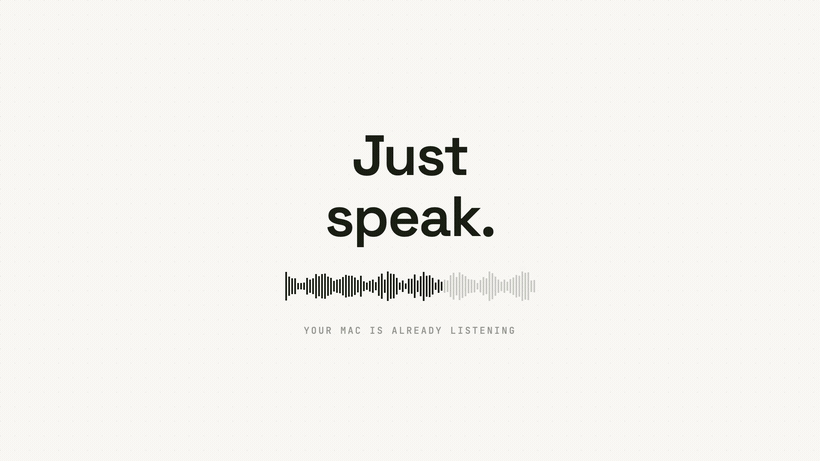
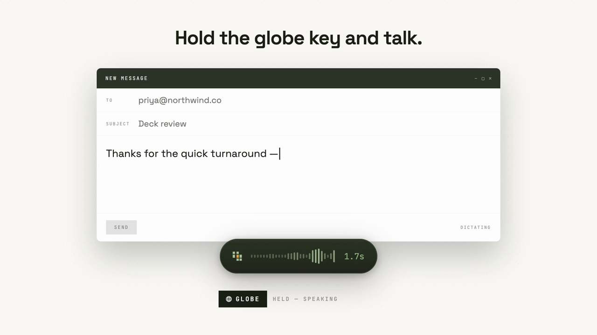
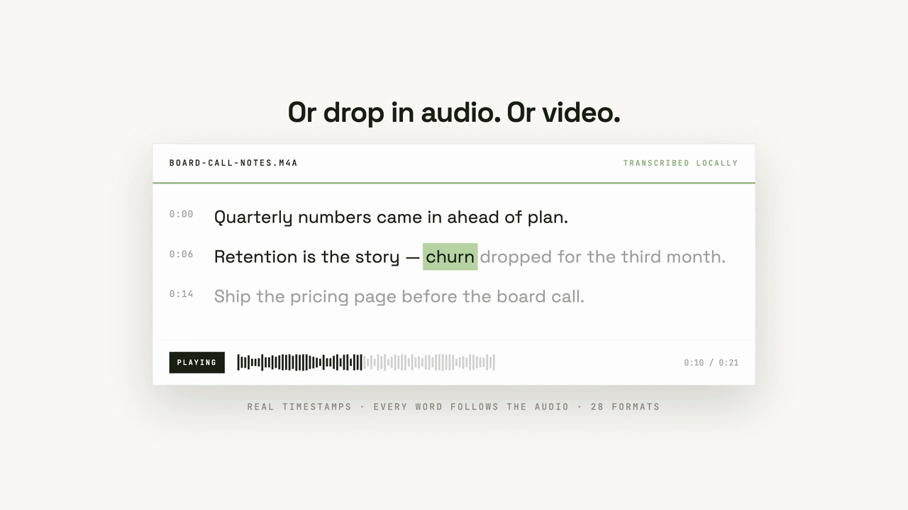
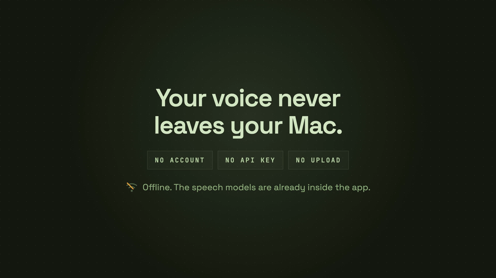
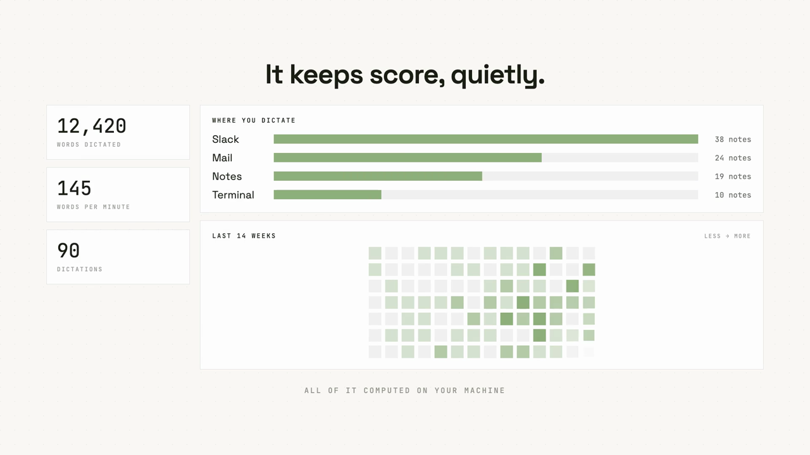

<div align="center">


# VoiceDumps

**Hold the globe key. Talk. The words appear where your cursor already was.**

Local speech-to-text for macOS. No account, no API key, nothing uploaded —
the speech models live inside the app and run on your own Mac.

[](https://github.com/heynaavi/voiceDump/releases/latest)
[](https://github.com/heynaavi/voiceDump/releases)




<sub>**[Watch with sound →](docs/media/launch-wide.mp4)** &nbsp;·&nbsp; [Portrait cut](docs/media/launch-portrait.mp4)</sub>

</div>

---

## What it does

You are already typing somewhere — Slack, Mail, a terminal, a code comment. Hold
the globe key, say the sentence, let go. The text lands at the cursor in the app
you were already in. Nothing switches, nothing is pasted by hand.

Then there is the other half: drop in audio or video and get a readable
transcript with real timestamps, word-level follow-along during playback, inline
editing that keeps the timings, full-text search across everything you have ever
dictated, and export to typeset PDF, Markdown or plain text.

## How fast, exactly

Numbers invite scepticism, so this repo ships the benchmark rather than the
claim:

```bash
scripts/bench.sh                        # 12s of synthesised speech
scripts/bench.sh path/to/your.wav       # or your own audio
VOICEDUMPS_MODEL_SIZE=small scripts/bench.sh
```

**Apple M1 Pro, 16 GB, macOS 27, 8 threads. `small` model. Time from the moment
you stop speaking to text on the clipboard.**

| You spoke for | Median | Worst of 3 |
| --- | --- | --- |
| 1.9 s | **377 ms** | 415 ms |
| 5.8 s | **423 ms** | 429 ms |
| 12.0 s | **898 ms** | 974 ms |

Note that the first two rows are the same number. whisper processes a fixed
30-second window, so everything shorter than that costs what the window costs —
a two-second "ship it Thursday" and a six-second sentence land in the same ~400 ms.

<details>
<summary>Full engine figures, both models, 12 s of speech</summary>

<br>

| | `small` | `medium` |
| --- | --- | --- |
| Model load | 0.20 s | 0.43 s |
| Transcribe | 0.90 s | 2.29 s |
| Speed vs realtime | 13× | 5× |
| Resident memory | 260 MB | 601 MB |

</details>

Three honest footnotes, because the table is flattering enough without them:

- **These were measured on battery at 8% charge**, which throttles an M1 Pro. They
  are a floor, not a best case. Run `scripts/bench.sh` plugged in and you should
  do better.
- **The timings exclude model load on purpose, and that is legitimate.** Dictation
  calls `engine::warm` the instant the key goes *down*
  ([`dictation.rs`](src-tauri/src/dictation.rs)), so the load overlaps with you
  still speaking. Speak for longer than half a second and you never pay it.
- **A genuinely first-ever load is much worse.** Reading the 539 MB medium file
  when it is nowhere in the OS page cache measured **9.7 s** here. Every
  subsequent load was ~0.4 s. First launch after install is the slow one.

Audio decoding is 2 ms of the budget — `symphonia`, in-process, no `ffmpeg` in
the transcription path at all.

## How it compares

Cloud dictation is the norm, and [Wispr Flow](https://wisprflow.ai/pricing) is
the best-known example — **$15/month or $144/year**, free tier capped at
[2,000 words per week](https://www.getvoibe.com/resources/wispr-flow-pricing/).

They publish their latency, which makes an honest comparison possible. Their
inference provider's case study, quoting Wispr Flow's CTO, states the pipeline
"runs end-to-end in **under 700 milliseconds**", and is explicit that this is a
**p99** target rather than a median
([Baseten](https://www.baseten.co/resources/customers/wispr-flow/)).

Against that published figure, for a normal dictation utterance:

| | Latency after you stop speaking |
| --- | --- |
| Wispr Flow (published, p99, cloud) | under 700 ms |
| **VoiceDumps** (measured, worst of 3, local, throttled) | **429 ms** |

That is roughly **39% faster** — and the comparison is deliberately stacked
against us: their p99 versus our worst case, on a laptop at 8% battery, with the
`small` model.

**Where that number stops being true.** Our latency scales with how long you
spoke; theirs is a mostly fixed pipeline cost because it transcribes while you
talk. Past roughly ten seconds of speech we lose that race — 12 seconds took us
~900 ms. The win is on short utterances, which is what dictation mostly is.

**And what their 700 ms buys that ours does not.** That budget includes a
fine-tuned Llama pass that reformats and contextualises the transcript, ~250 ms
of it by their own account. We do not do that. We hand you what you said.

The rest is architecture, and it does not move:

| | VoiceDumps | Cloud dictation |
| --- | --- | --- |
| Price | Free | Typically $12–15/month |
| Word limits | None | Free tiers are usually capped |
| Works on a plane | Yes | No |
| Where your voice goes | Stays on the disk it recorded to | Uploaded for inference |
| Account required | No | Yes |
| Network round trip | **None** | Once per utterance |
| Can have an outage | No | [Yes](https://www.getvoibe.com/resources/wispr-flow-outage-june-2026/) |

A cloud service cannot start before your audio arrives. From this machine, *just
the TLS handshake* — before a byte of audio moves or a single token is generated —
measured **19 ms** to an edge-cached endpoint and **544–564 ms** to two regional
speech APIs. Local pays zero of that, every time, and does not get slower on
hotel wifi.

Where cloud genuinely wins: a datacentre GPU running a larger model beats `small`
on hard audio — thick accents, crosstalk, bad microphones — and it will format
your text for you. If that is your workload, run `medium` and take 5× realtime
instead of 13×.

## Inside

<table>
<tr>
<td width="50%">

**Dictation, over any app**



The pill is its own accessory process
([`overlay-helper/main.swift`](overlay-helper/main.swift)) — a Tauri webview
cannot float over another app's full-screen Space, an `NSPanel` can. The level
bars are the real signal: CoreAudio RMS, metered every 50 ms.

</td>
<td width="50%">

**Transcripts you can actually read**



Whisper emits 5–10 second fragments, which are miserable to read.
`build_paragraphs` merges them on real pauses after completed sentences. Word
timings survive, so playback follows along and editing keeps the sync.

</td>
</tr>
<tr>
<td width="50%">

**It stays on your machine**



The weights are bundled in the `.app`. Nothing is fetched at runtime, so a fresh
install works offline on first launch, and there is no key to leak because there
is no service to call.

</td>
<td width="50%">

**What the history knows**



Words, pace, which apps you dictate into, and an activity grid — computed
locally in [`analytics.rs`](src-tauri/src/analytics.rs). It refuses to print a
words-per-minute figure from too thin a sample rather than guessing.

</td>
</tr>
</table>

<sub>Images are stills from the launch film in `docs/media`, which rebuilds the
product's own UI at 1080p rather than screenshotting it.</sub>

## Install

Grab the DMG from [**Releases**](https://github.com/heynaavi/voiceDump/releases/latest)
— Apple Silicon, macOS 11 or later, about 720 MB because the speech models are
inside it.

Two permissions on first run, both unavoidable for what it does:

| Permission | Why |
| --- | --- |
| **Accessibility** | The globe key is a *modifier*, not a keycode. It emits no key-down event, so no shortcut API can see it — reading it needs a `CGEventTap`. |
| **Microphone** | To hear you. |

Also set **System Settings → Keyboard → "Press 🌐 to:" → Do Nothing**, or macOS
opens the emoji picker underneath the app.

## Build it yourself

Needs Node, Rust and CMake (whisper.cpp builds with it). No Python and no
`ffmpeg` for the transcription path.

```bash
npm install
npm run models         # ~730 MB of ggml weights into ./models
npm run tauri dev      # or: npm run build:lite  → .app + .dmg
```

<details>
<summary><b>The models, and which one you get</b></summary>

<br>

Two quantised multilingual ggml models, both bundled:

| | File | On disk | Resident |
| --- | --- | --- | --- |
| `small` | `ggml-small-q5_1.bin` | 190 MB | 260 MB |
| `medium` | `ggml-medium-q5_0.bin` | 539 MB | 601 MB |

Chosen at launch by memory, not chip generation: **16 GB or more gets `medium`**,
below that `small`. A base M1 with 8 GB is already juggling a browser and an
editor, and making the whole machine swap to win a little accuracy is a bad
trade. Force either with `VOICEDUMPS_MODEL_SIZE=small|medium`.

Multilingual rather than the `.en` variants because the app already handles
non-English notes; q5 because the accuracy difference is inaudible next to
halving the download.

</details>

<details>
<summary><b>Architecture</b></summary>

<br>

| Layer | Path | Role |
| --- | --- | --- |
| UI | `src/` | React + Tailwind. Reader, history, insights, drag-drop. |
| Shell | `src-tauri/` | Tauri v2. Owns the SQLite history, the globe-key tap and the engine. |
| Engine | `src-tauri/src/engine.rs` | whisper.cpp via `whisper-rs`, Metal-accelerated. In-process. |
| Overlay | `overlay-helper/` | Swift `NSPanel` for the dictation pill and PDF typesetting. |

Transcription used to run in a Python sidecar on MLX. That worked but could
never ship: it needed a 1 GB virtualenv, the `mlx` stack, and `ffmpeg` on the
user's `PATH`. "Download the app and run it" is not possible on those terms, so
the engine moved in-process and the weights became a bundled resource.

**The model stays warm.** Loading costs real time, so one `WhisperContext` is
held between jobs and back-to-back dictations pay nothing for it. Two callers
racing — a warm-up and the transcription it was warming for — would each build a
context and spike memory, so the lock is deliberately held across the load.

The context is released on quit, and that teardown is load-bearing rather than
tidy: `-[NSApplication terminate:]` calls `exit()`, which drops nothing Rust
owns, so a live context was still holding Metal residency sets when ggml-metal
asserted they were all released — `abort()`, and macOS reporting a crash on an
ordinary quit. There is a regression test that runs the exit in a child process,
because the behaviour under test is what happens *during* exit.

**Text is pasted, not typed.** Synthetic keystrokes are slow and get mangled by
autocorrect and input methods, so the transcript goes to the clipboard and the
app synthesises ⌘V.

</details>

<details>
<summary><b>Your data</b></summary>

<br>

Transcripts live in SQLite at
`~/Library/Application Support/dev.heynaavi.voicedump/voicedumps.db`, with an FTS5
index behind the search box.

Audio is **copied** into `…/media/`, organised by month, so playback survives you
moving or deleting the original — the store keeps both the archived copy and the
path it came from. That copy is transcoded with `ffmpeg` when it is available and
skipped when it is not; transcription never depends on it.

Nothing is transmitted. There is no telemetry, no crash reporting and no update
check in this build.

</details>

<details>
<summary><b>Tuning</b></summary>

<br>

| Variable | Meaning |
| --- | --- |
| `VOICEDUMPS_MODEL_SIZE` | `small` or `medium`, overriding the memory-based choice |
| `VOICEDUMPS_MODEL_DIR` | Where to find the weights, ahead of the bundled resources |
| `TEST_AUDIO` | Audio file for the engine tests and `scripts/bench.sh` |

</details>

## Tests

```bash
cargo test --manifest-path src-tauri/Cargo.toml --no-default-features
```

The interesting ones need real inputs and skip loudly without them:

| Test | What it proves |
| --- | --- |
| `transcribes_real_audio` | A file decodes and transcribes with no Python and no `ffmpeg` in the path |
| `exits_cleanly_with_a_model_loaded` | Quitting with a model resident does not abort |
| `benchmark_latency` | The numbers above. `#[ignore]`d — it is a measurement, not an assertion |

## Known gaps

Stated plainly, because a README that only lists wins is not worth reading:

- **The model is not released while the app idles.** It loads on demand and stays
  resident until quit — roughly 600 MB for `medium`. `engine_unload` exists and
  works, but nothing calls it on an idle timer yet, so a menu-bar app that sits
  on 600 MB all day is currently exactly what this is. Fixing it is the next
  thing worth doing.
- **Apple Silicon only.** The arm64 build does not run on Intel Macs, and Windows
  and Linux are not supported.
- **No licence yet.** There is no `LICENSE` file in this repo, which means the
  default is "all rights reserved" and nobody can safely reuse the code. That
  needs choosing before this is meaningfully open source.

## Roadmap

- Release the model after an idle period, rather than at quit
- Watch a folder for auto-transcription
- Local audio enhancement — podcast-grade cleanup, tunable

<div align="center">
<br>
<sub>Built by <a href="https://www.kupacreative.com">Kupa</a> · <a href="https://voicedumps.qwee.ai">voicedumps.qwee.ai</a></sub>
</div>
